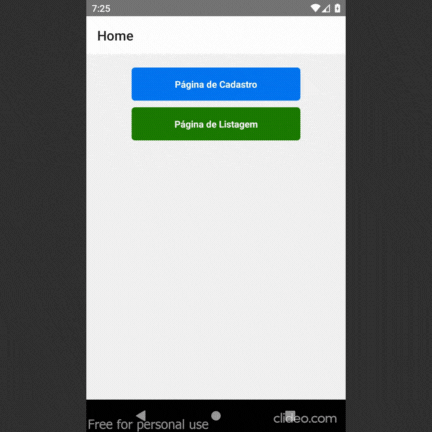

# React_Native_Imobiliaria
Repositório para ao versionamento do App "Imobiliaria" destinado à organização de Imóveis para Aluguel.

## Descrição
O App "Imobiliaria" é uma aplicação para organizar melhor imóveis para locação ou venda, no App é 
possível cadastrar informações sobre os imóveis juntamente com uma foto, e também conta com uma 
página de listagem que reúne as informações cadastradas.
Essa aplicação foi construída como uma atividade para o curso Técnico em Informática para a Internet,
com a proposta de implementar recursos nativos do aparelho como o uso da câmera e do armazenamento do 
dispositivo.

## Instalação
1. Baixe o arquivo .zip do Projeto.
2. Extraia o projeto e abra no seu editor de código-fonte.
3. Execute no terminal o comando `npm install` para a instalação de todos os pacotes do projeto.
4. Rode o projeto e confira.

## Uso
No App Imobiliaria você pode cadastrar e vizualisar todos os imóveis disponíveis para locação ou venda,
o que auxilia na organização de corretores.

